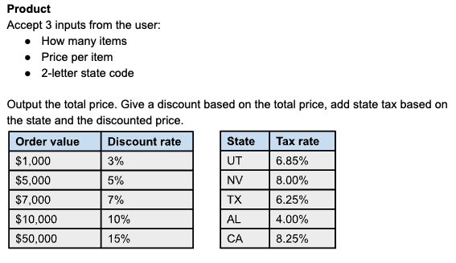

# Elephant Carpaccio Kata

Este proyecto es la base para empezar a realizar la Kata de la Elephant Carpaccio en PHP con Docker.

## Pasos a seguir para levantar entorno
1. Clonar el repositorio
```
git clone git@github.com:540/elephant-carpaccio-docker-php-boilerplate.git
```
2. Ejecutar el comando `make` para construir el container de docker
```
make
```
3. Ejecutar el comando `make serve` para levantar el servidor (http://localhost:8000)
```
make serve
```
4. A disfrutar de la kata!

## Enunciado


## Requisitos
- [Docker](https://www.docker.com/)
- [Make](https://www.gnu.org/software/make/)